# Tutorial de Prolog Parte 2

En este tutorial se abordará más información sobre Prolog, incluyendo aspectos como su uso en otros editores de texto, la máquina de inferencia, y el concepto de *backtracking*.

> **Nota**: Debes tener instalado previamente SWI Prolog. Puedes encontrar un tutorial sobre cómo instalarlo [aquí](https://github.com/ingrid717-py/Prolog/blob/main/Tutorial%20GitHub_Prolog%20Mac_Windows.pdf "Tutorial Prolog Parte 1"), o bien, usar el complilador online (https://swish.swi-prolog.org/)

## Contenido

- [Usar Prolog en Visual Studio Code (Solo Windows) - Opcional](#usar-prolog-en-visual-studio-code--solo-windows----opcional)
    - [Paso 1. Instalar Visual Studio Code](#paso-1-instalar-visual-studio-code)
    - [Paso 2. Agregar swipl a las variables de entorno](#paso-2-.-agregar-swipl-a-las-variables-de-entorno)
    - [Paso 3. Instalar extensión de Prolog](#paso-3-instalar-extensión-de-prolog)
- [Comandos Básicos](#comandos-básicos)
- [Términos](#términos)
    - [Constantes](#constantes)
    - [Variables](#variables)
    - [Estructuras](#estructuras)
- [Operadores](#operadores)
    - [Operadores Aritméticos](#operadores-aritméticos)
    - [Operadores Relacionales](#operadores-relacionales)
    - [Operadores Lógicos](#operadores-lógicos)
- [Listas](#listas)
- [¿Qué es un Predicado?]()
- [Máquina de Inferencia en Prolog](#máquina-de-inferencia-en-prolog)
- [Backtracking en Prolog](#backtracking-en-prolog)
- [Extensiones](#extensiones)
- [Referencias](#referencias)

## Usar Prolog en Visual Studio Code (Solo Windows) - Opcional
***
Una de las características de SWI Prolog es que al funcionar como una Interfaz de Línea de Comandos (CLI) es posible utilizarla dentro de la pestaña Terminal que ofrece el editor de Texto Visual Studio Code, para así tener todo lo necesario para programar en Prolog en un solo lugar.

### Paso 1. Instalar Visual Studio Code
***
Ingresa al sitio web de [Visual Studio Code](https://code.visualstudio.com/ "Visual Studio Code Website") y selecciona la opción de Windows x64 Stable para descargar.

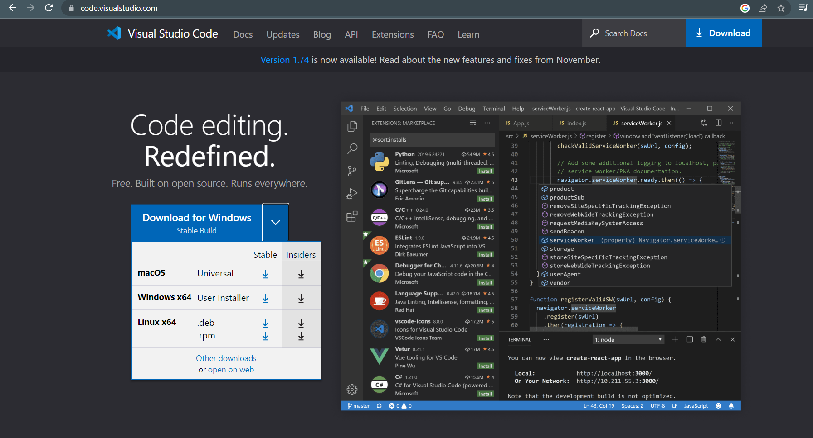


Después, se ejecuta el archivo descargado y se abrirá la ventana de instalación, en la cual inicialmente se deberá aceptar el acuerdo y dar click en Siguiente.

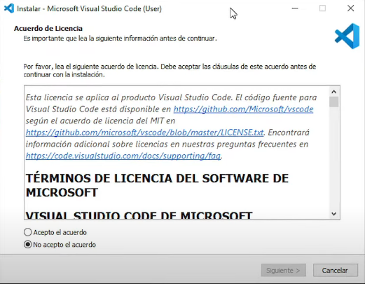

Luego, se debe elegir la ruta de instalación del Visual Studio Code (o dejar la ruta predeterminada) y dar click en Siguiente.

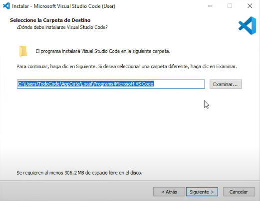

Seguidamente, se debe seleccionar el nombre que se desea para la carpeta de Inicio (o dejar la opción predeterminada) y se da click en Siguiente.

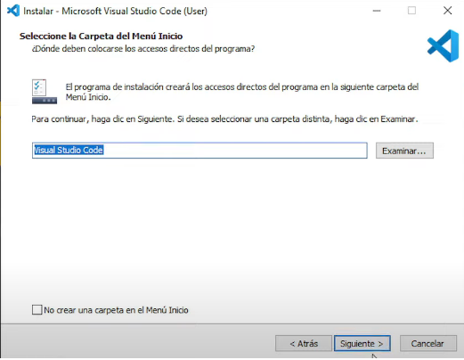

Subsecuentemente, se deben seleccionar las Tareas Adicionales que se desean (o dejar las opciones predeterminadas) y se procede a dar click en Siguiente.

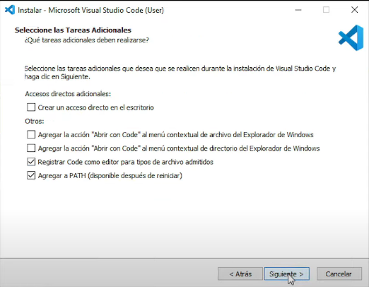

La siguiente sección mostrará todas las configuraciones que se realizarán al momento de instalar Visual Studio Code. Se procede a dar click en Instalar.

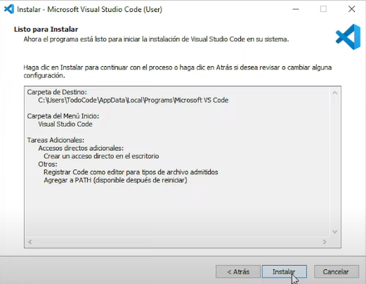

Una vez la instalación haya finalizado aparecerá una ventana que permite abrir Visual Studio Code una vez se seleccione la opción Finalizar. Se deja marcada la opción y se selecciona la opción Finalizar.

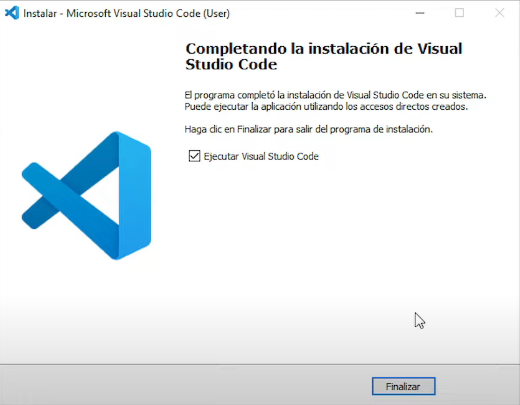

Una vez se haya dado click a esa opción el programa de Visual Studio Code se iniciará y se podrá proseguir con el siguiente paso.

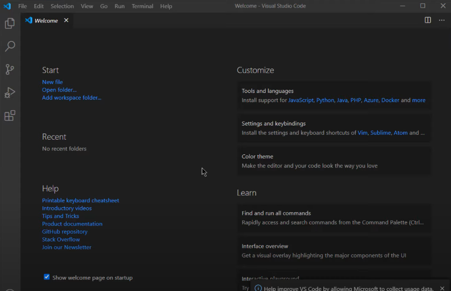

### Paso 2. Agregar swipl a las variables de entorno
***
En el buscador de Windows se escribe la palabra clave "variables" y se selecciona la opción de "Editar las variables de entorno del sistema".

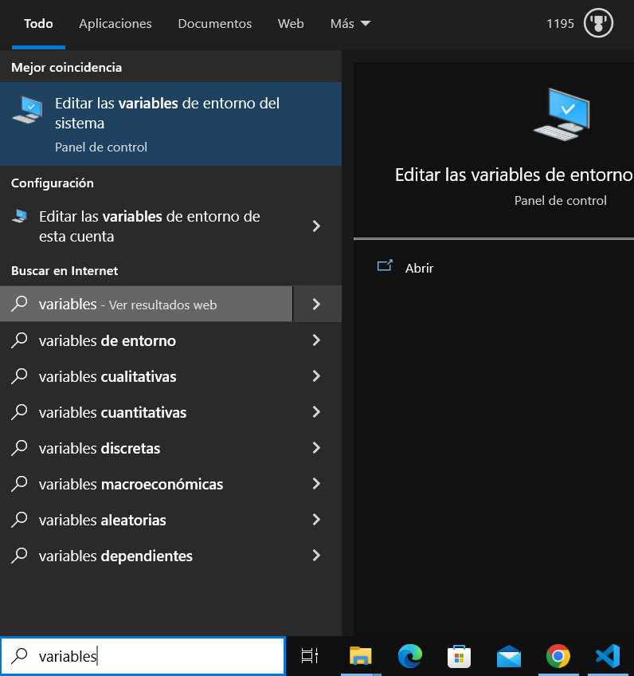

Se abrirá una ventana y se selecciona la opción de "Variables de entorno".

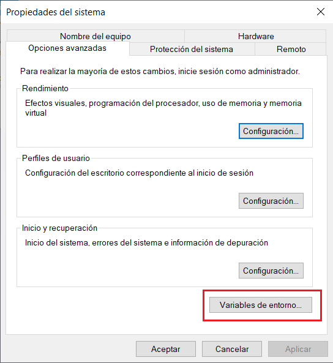

Se abrirá una nueva pestaña y se selecciona la variable "Path" que se encuentra en la sección de "Variables del Sistema".

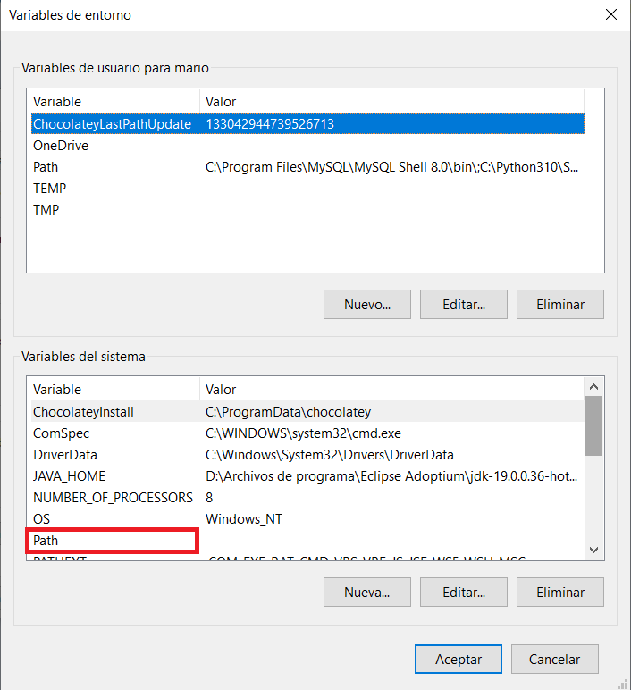

Se abrirá una nueva ventana y se da click en la opción "Nuevo". Después se agregará la ruta de la carpeta bin de SWI Prolog (swipl). Una vez se haya ingresado la ruta de la carpeta se dará click en las opciones de "Aceptar" o "Aplicar" en las ventanas que se abrieron previamente.

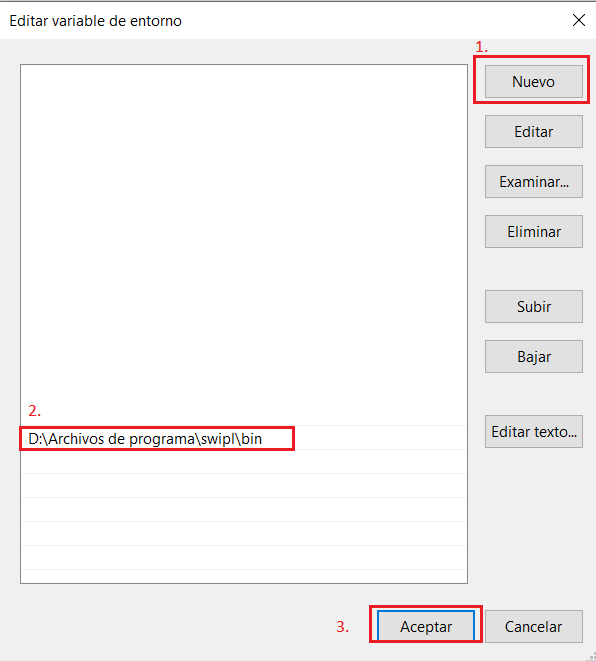

> **Nota:** Será necesario reiniciar Visual Studio Code para que pueda leer la ubicación donde se encuentra la carpeta bin de SWI-Prolog.

Una vez finalizado este paso se puede proceder al paso 3.

### Paso 3. Instalar extensión de Prolog
***
En el Visual Studio Code se debe buscar la opción de extensiones, y una vez encontrada se coloca en el buscador la palabra clave "prolog", se selecciona la primera opción, y se instala.

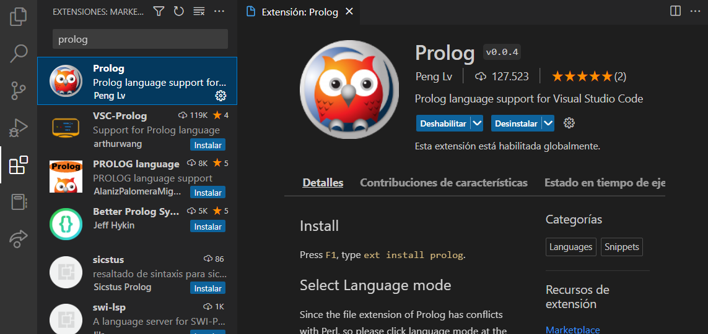

Una vez instalada la extensión ya se puede crear un archivo .pl (extensión para archivo Prolog) pero incialmente aparecerá en la siguiente sección del Visual Studio que el modo de lenguaje es Perl. Procedemos a darle click a esa opción.


Una vez selccionada esa opción, nos aparecerá una ventana que solicitará el modo de lenguaje a utilizar. Se busca y selecciona la opción que diga "Prolog".

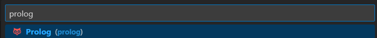

Una vez seleccionada esa opción ahora se puede proceder a abrir una Nueva Terminal en Visual Studio Code y una vez ésta se encuentre abierta se escribe la palabra clave "swipl" para así poder iniciar SWI Prolog dentro de Visual Studio Code.

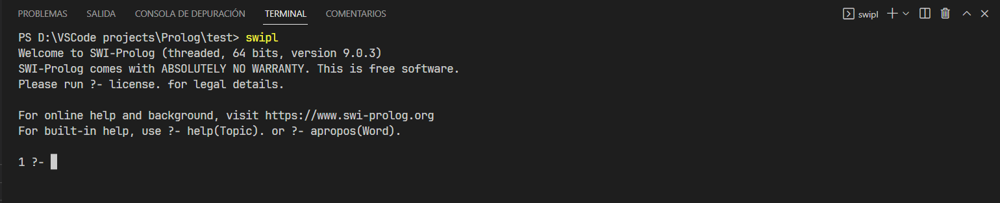

Para poder cargar un archivo en la terminal se procede a escribir el siguiente comando:

```prolog
consult("nombre_del_archivo.pl").
```
Cuando la terminal te devuelva un valor true significa que ya puedes realizar consultas dentro de prolog con información de ese archivo.

> **Nota:** Tenga en cuenta que cada línea de código (incluidas las consultas) debe terminar con un punto

## Comandos Básicos
***
Algunos de los comandos básicos e importantes que pueden ser utilizados en SWI-Prolog son los siguientes:

- `consult("nombre_del_fichero.pl").` - Carga de archivo

- `["archivo1.pl"].` - Forma alternativa para carga de archivo

- `["archivo1.pl","archivo2.pl",... ].` - Carga de varios archivos

- `reconsult("nombre_del_fichero.pl").` -Recarga de archivo

- `halt.` - Salida de SWI-Prolog 

- `pwd.` - Directorio actual

- `ls.` - Lista de contenido del directorio actual

## Términos
***
Los términos son los principales y únicos elementos que conforman un programa en Prolog, pudiendo ser de tipo constante, variable, o estructura.

### Constantes
***
Los términos constantes son aquellos que pueden ser atómicos (elementos que empiezan en minúsculas (o puede ser un símbolo de puntuación, secuencia de signos de puntuación, o una sucesión de caracteres encerrada entre comillas simples) y representan nombres de objetos, propiedades, o relaciones), y de tipo número (valores enteros o reales que pueden llevar signo).

```prolog
% Términos de tipo atómico o functor
atomo(Pepe).
atomo('Luis').
atomo(rosa).

% Términos de tipo número
numero(5).
numero(-4.31).
numero(6e10).
```
### Variables
***
Las variables (o variables lógicas dentro de Prolog) son un tipo de dato lógico que empieza con mayúscula o guión bajo, evitando así declarar estas expresiones de forma previa. También existe un tipo especial de variables llamadas *variables anónimas*, las cuales tienen la peculiaridad de hacer verdadera una consulta pero sin saber qué valor es, y se indican solamente con un guión bajo.

```prolog
% Variable 
1 ?- alimento(X).
X = pescado.

% Variable anónima
2 ?- alimento(_).
true.

```

### Estructuras
***
Las estructuras son términos compuestos por otros términos los cuales poseen la siguiente estructura:

`nombre_atomo(termino1, termino2, ... terminoN)`

donde los terminos de 1 a N se llaman argumentos y nombre átomo se le llama predicado.

```prolog

animal(perro). % Estructura de un solo argumento
edad(Sara, 23). % Estructura de más de un argumento
color(X) % Estructura con átomo de nombre color y un argumento que es una variable

```
## Operadores
***
Prolog maneja múltiples operadores los cuales permiten una mejor manipulación de los datos que se están tratando. 

> **Nota:** Al momento de insertar algunos de los operadores (como los relacionales y lógicos), Prolog puede devolver *true* o *false* dependiendo el caso que se esté tratando.

Algunos de los operadores que Prolog puede utilizar son los siguientes:

### Operadores Aritméticos
***
| Operador | Significado                 |
|----------|-----------------------------|
| +        | Suma                        |
| -        | Resta                       |
| *        | Multiplicación              |
| / y //   | División real y entera      |
| ^ o **   | Potencia                    |
| +        | Positivo                    |
| -        | Negativo                    |

### Operadores Relacionales
***
| Operador | Significado       | Ejemplo    | 
|----------|-------------------|----------- |
| is       | Unificación       | Y is 2+3   |
| =:=      | Igualdad          | 5 =:= 2+3  |
| =\\=     | Desigualdad       | 7 =\\= 5+4 |
| >        | Mayor que         | 24 > 2^3   |
| <        | Menor que         | 15 < 17    |
| >=       | Mayor o igual que | 3 >= 1     |
| <=       | Menor o igual que | 1 <= 9     |

### Operadores Lógicos
***

| Operador       | Significado       |
|----------------|-------------------|
| ,              | AND lógico        |
| ;              | OR lógico         |
| not(predicado) | NOT lógico        |
| :-             | IF lógico        |

> **Nota:** Cabe señalar que todos los operadores mencionados pueden utilizarse en conjunción con expresiones matemáticas como *cos, tan, abs*.

## Listas
***
Las listas son estructuras con una secuencia ordenada de cualquier tipo de términos, conformada de forma recursiva por una cabeza (primer elemento de la lista) y una cola (resto de elementos de la lista).

La notación para los componentes de una lista es [A | B] donde A es la cabeza y B es el cuerpo.

```prolog
ultimo([Result], Result).						% Base
ultimo([_|L], Result) :- ultimo(L, Result).		% Recursividad

1 ?- ultimo([a, [b,c], 2], Ultimo).
Ultimo = 2.
```

El ejemplo anterior muestra un caso para obtener el último elemento de una lista, donde se aprecia la notación en la sección recursiva, y la cabeza de la lista.

## ¿Qué es un predicado?
***
Los predicados (son todos aquellos elementos que pueden ser ejecutados en Prolog, teniendo cierto parecido con la forma en la que funciona una función en lenguajes de programación como Python, Java, o C. 

Es importante indicar que la acción de realizar un llamado a un predicado (cuando se invoca dentro de la Línea de Comando de Prolog), haciendo uso de argumentos particulares (un término o una variable) se le conoce como *objetivo (goal)*, teniendo así un resultado (para los argumentos proporcionados) de éxito (*true*) o fallo (*false*), el cual es indicado en la consola donde se está utilizando Prolog.

Un objetivo al tener un resultado exitoso provoca que las variables libres que pueden aparecer en los argumentos queden ligadas (proceso que se conoce como *unificación*), siendo estos valores los que vuelven ciertos el predicado. Si el predicado llegase a fallar, la unificación no ocurre. 

También es importante indicar que los predicados pueden ser hechos o reglas.

Un ejemplo de predicado es el siguiente:

```prolog
% Hechos
estudiante(Alfonso).
profesor(Ingrid).

% Reglas
mentorado(A, B) :-
    estudiante(A),
    profesor(B).
```

Como se aprecia en el ejemplo anterior, están indicados dos hechos (estudiante y profesor) y una regla (mentorado), los cuales poseen ciertos argumentos (en el caso de los hechos son relaciones, y en el caso de la cabeza y cuerpo de la regla son variables). En este caso el nombre de estos hechos y reglas serían los predicados, y si se ejecutan dentro de la Línea de Comando de Prolog mediante el uso de constantes o variables el resultado puede ser exitoso o no, como se muestra a continuación.

```
1 ?- estudiante(Alfonso).
true.

2 ?- profesor(X).
X = Ingrid.

3 ?- mentorado(Alfonso, Ingrid).
true.
```

## Máquina de Inferencia en Prolog

***
La maquina de inferencia (*inference machine*) puede razonar con soluciones producidas por ciertas metas a través de el backtracking. 

Este está compuesto por 2 elementos:
- **Interprete de reglas**
- **Estrategia de control**

Estas 2 se ejecutan para resolver problemas a partir de hechos dados y a través de la interaccion con el usuario, pudiendo así deducir o inferir información, y descubrir nuevos hechos.

Este motor tiene un ciclo basico:
 1. **Detección**: Conjunto de reglas aplicables
 2. **Seleccion**: Solución de conflictos 
 3. **Aplicacion**: Ejecución de las reglas
 
Los tipos de razonamiento que pueden aplicarse dentro de este proceso pueden ser *deductivos*, *inductivos* y/o *mixto*.
 
```prolog
paises(Andorra).
paises(Japon).
paises(Mexico).


1 ?- paises(Mexico).
true.

2 ?- paises(Houston).
false.
```

## Backtracking en Prolog
***
Backtracking es un procedimiento en donde prolog busca el valor de verdad de diferentes predicados revisando si son correctos o no. En caso de que el sistema llegue al objetivo, vuelve a intentar buscar una solución alternativa.

Mientras se ejecuta algún código de Prolog, durante el Backtracking puede haber varias respuestas, pudiendo presionar el punto y coma (;) para obtener las siguientes respuestas una por una, lo que ayuda a hacer el backtracking. De lo contrario, en caso de no haber otras soluciones alternativas cuando se obtenga un resultado, se detendrá.

El funcionamiento del backtracking puede explicarse utilizando una estructura de arbol.
***
### Ejemplo 1


Supongamos que A a G son algunas reglas y hechos. Partimos de A y queremos llegar a G. El camino correcto será A-C-G, pero al principio irá de A a B, luego de B a D. Cuando descubre que D no es el destino, retrocede a B, luego va a E, y retrocede nuevamente a B, ya que no hay otro nodo hijo de B, luego retrocede a A, por lo que busca G, y finalmente encuentra G en el camino A-C-G. (Las líneas discontinuas indican el retroceso). Entonces, cuando encuentra G, se detiene.
***
### Ejemplo 2

Ahora, considere una situación en la que dos personas, X y Y, pueden pagarse entre sí, pero la condición es que un niño puede pagarle a una niña, por lo que X será un niño y Y será una niña. Entonces, para estos, se han definido algunos hechos y reglas:

``` prolog
boy(tom).
boy(bob).
girl(alice).
girl(lili).
pay(X,Y) :- boy(X), girl(Y).
```

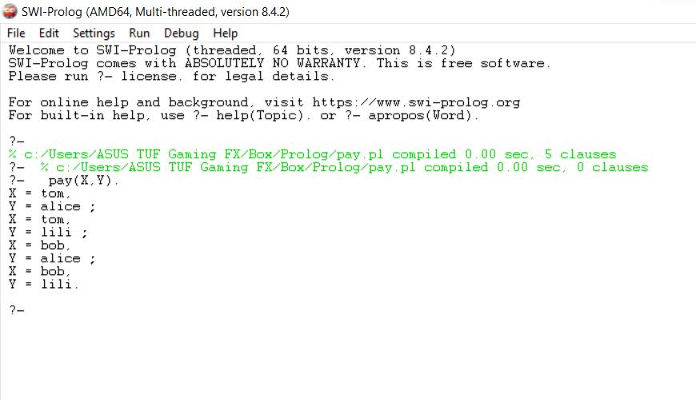


En la ejecución de este programa se pueden ver todas las soluciones posibles cuando se llama a la regla pay (X,Y).Al principio arroja una solución partiendo de izquierda a derecha como se puede ver abajo en el arbol de soluciones. Sin embargo, si se pulsa ; se fuerza al sistema a hacer backtracking por lo que se puede tener acceso a todas las soluciones.

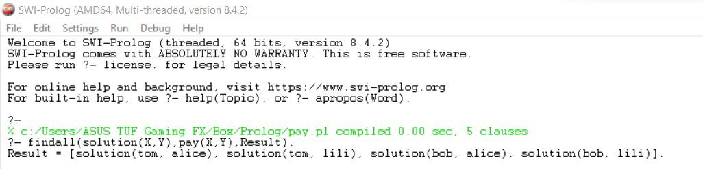

En esta ejecución del programa usando el predicado findall se pueden obtener todas las soluciones sin necesidad de forzar el backtracking con ; , ya que la busqueda la hace automaticamente.


Como X será un niño, entonces hay dos opciones, y para cada niño hay dos opciones, Alice y Lili.

De igual manera, en los ejemplos siguientes se puede hacer uso de esto, llamando a una regla(X,Y) y pulsar ; para obtener todas las soluciones como se puede ver a continuación:

```prolog
dog(fido).
dog(rover).
dog(henry).
cat(felix).
cat(michael).
cat(jane).
friend(X):-dog(X).
```
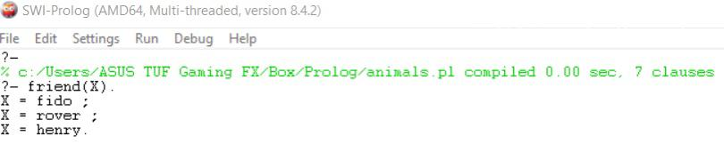
En este programa de perros y gatos se define la regla de amigo dado que es un perro. Por lo que haciendo backtracking arroja todos los posibles amigos.

```prolog
animal(lion).
animal(tiger).
animal(cow).
carnivore(lion).
carnivore(tiger).
```
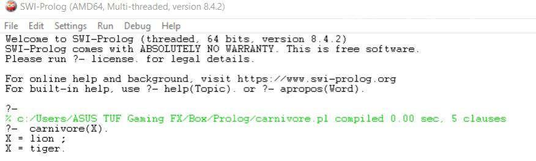

En este programa de animales carnivoros usando únicamente hechos sin reglas es posible saber dado un predicado quienes son todos los atomos que cumplen el hecho de ser carnivoro que en este caso son el león y el tigre.

## Extensiones
***
Una característica de SWI-Prolog es su capacidad de permitir al usuario la instalación de extensiones, las cuales permiten la realización de funciones que Prolog no posee por defecto.

> **Nota:** Cabe señalar que su funcionamiento es como el de una librería en lenguajes como Java, Python, o C# donde una vez son llamados al programa, es posible hacer uso de los hechos y reglas que poseen.

Algunos comandos útiles que pueden ser utilizados en el uso de extensiones son los siguientes:

- `doc-browser.` - Permite navegar, abrir, y modificar los archivos de las extensiones que se encuentran instaladas

- `pack_list('').` - Lista de todas las librerías extensiones y disponibles para instalar

- `pack_list_installed.` - Lista de todas las extensiones instaladas

- `pack_install(nombre_de_extensión).` - Instalación de extensión

- `pack_upgrade(nombre_de_extensión).` - Intento de actualización de extensión

- `pack_remove(nombre_de_extensión).` - Eliminación de la extensión indicada

- `pack_info(nombre_de_extensión).` - Imprime más información sobre la extensión

En la siguiente imagen se pueden apreciar algunas de las extensiones que se pueden instalar en SWI-Prolog.


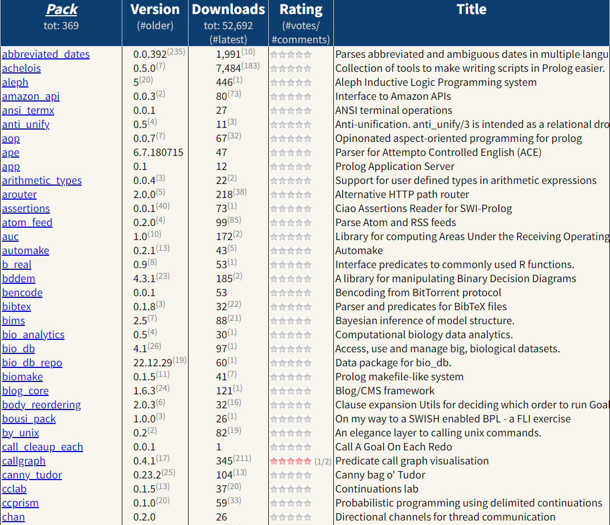

## Referencias
***
Ceccaroni, L. (2007). *Inteligencia Artificial.*  Universidad Politécnica de Cataluña. https://www.cs.upc.edu/~luigi/II/IA-2007-fall/3b-inferencia-en-agentes-basados-en-conocimiento-(es).pdf

*Curso Avanzado de Prolog.* (s.f.). Programación.net. Recuperado el 30 de enero de 2023 de https://programacion.net/articulo/curso_avanzado_de_prolog_166/5

Fernández García, N. L. (2020). *Comandos SWI-Prolog*. Universidad de Córdoba. http://www.uco.es/users/ma1fegan/2019-2020/pd/temas/comandos_swi_prolog.txt

Freddy Geek. (2021, marzo 22). *Aprende a estructurar Hechos en Prolog Parte 2* [Video]. YouTube. https://youtu.be/HfA7JVwTv4o

González Carrillo, C. D., & Salomón Torres, J. E. (s.f.). *Tutorial de Prolog*. SWISH. Recuperado el 30 de enero de 2023 de https://swish.swi-prolog.org/p/Tutorial%20de%20prolog.swinb

*Guía Básica de Prolog.* (s.f.). Universidad de Las Palmas de Gran Canaria. Recuperado el 30 de enero de 2023 de http://www.gedlc.ulpgc.es/docencia/lp/documentacion/GB_Prolog.pdf

*Prolog - Backtracking.* (s.f.). TutorialsPoint. Recuperado el 30 de enero de 2023 de https://www.tutorialspoint.com/prolog/prolog_backtracking.htm

*Tutorial básico de programación en Prolog.* (s.f.). Programación.net. Recuperado el 30 de enero de 2023 de https://programacion.net/articulo/tutorial_basico_de_programacion_en_prolog_58/4

*Tutorial básico de programación en Prolog.* (s.f.). Universidad Nacional de Rosario. Recuperado el 30 de enero de 2023 de https://www.dsi.fceia.unr.edu.ar/downloads/IIA/recursos/Tutorial%20de%20%20Prolog.pdf
