# Searching Methods

## Contenido

- [Búsqueda no informada](#Búsqueda-no-informada)
    - [Algoritmos no informados vs informados](#Algoritmos-no-informados-vs-informados)
- [Búsqueda en profundidad (DFS)](#Búsqueda-en-Profundidad)
    - [Características de la Búsqueda en Profundidad](#Características-de-la-Búsqueda-en-Profundidad)
    - [Proceso para implementar la Búsqueda en Profundidad](#Proceso-para-implementar-la-Búsqueda-en-Profundidad)
    - [Estrategias para implementar la Búsqueda en Profundidad](#Estrategias-para-implementar-la-Búsqueda-en-Profundidad)
    - [Aplicaciones de la Búsqueda en Profundidad](#Aplicaciones-de-la-Búsqueda-en-Profundidad)
    - [Ejemplo de Búsqueda en Profundidad](#Ejemplo-de-Búsqueda-en-Profundidad)
- [Búsqueda en Amplitud o Anchura (BFS)](#Búsqueda-en-Amplitud-o-Anchura)
    - [Características de la Búsqueda en Amplitud](#Características)
    - [Proceso para implementar la Búsqueda en Anchura](#Proceso-para-implementar-la-Búsqueda-en-Anchura)
    - [Aplicaciones del Algoritmo BFS](#Aplicaciones-del-Algoritmo-BFS)
    - [Ejemplo Búsqueda en Amplitud o Anchura](#Ejemplo-Búsqueda-en-Amplitud-o-Anchura)
- [Ejemplo de DFS en Prolog](#Ejemplo-de-DFS-en-Prolog)
- [Complejidad de DFS](#Complejidad)
- [Ventajas de DFS](#Ventajas)
- [Desventajas de DFS](#Desventajas)
- [Ejemplo de BFS en Prolog](#Ejemplo-de-BFS-en-Prolog)
- [Complejidad de BFS](#Complejidad-de-BFS)
- [Ventajas de BFS](#Ventajas-de-BFS)
- [Desventajas de BFS](#Desventajas-de-BFS)
- [Referencias](#referencias)

## Búsqueda no informada


Como el nombre 'Búsqueda no informada' significa que la máquina sigue ciegamente el algoritmo sin considerar el costo de alcanzar la meta, la probabilidad de encontrar una solución o si la solución obtenida es correcta o incorrecta. Estos algoritmos tienen una naturaleza de fuerza bruta y no tienen información adicional sobre el espacio de búsqueda; la única información que tienen es sobre cómo atravesar o visitar los nodos en el árbol.

Por lo tanto, los algoritmos de búsqueda no informados también se denominan algoritmos de búsqueda ciega y son los conceptos básicos de los algoritmos de búsqueda en IA.

Los algoritmos de búsqueda no informada a menudo son fáciles de implementar y comprender, y los dos enfoques básicos difieren en cuanto a si verifica un objetivo cuando se genera un nodo o cuando se expande.
Algunos ejemplos de estos algoritmos son:

1. Depth First Search (DFS)
2. Breadth-First Search(BFS)
3. Uniform Cost Search(UCS) 
4. Depth Limited Search(DLS) 
5. Iterative Deepening Depth First Search(IDDFS)
6. Bidirectional Search(BS)

Todos estos ejemplos tienen diferentes complejidades de tiempo y espacio que los hacen más adecuados para diferentes problemas específicos, sin embargo, solo explicaremos los primeros dos ejemplos (DFS y BFS)

### Algoritmos no informados vs informados

Los algoritmos informados tienen información sobre el estado objetivo que ayuda a una búsqueda más eficiente. Esta información se obtiene mediante una función que estima qué tan cerca está un estado del estado objetivo. La búsqueda informada en IA es un tipo de algoritmo de búsqueda que utiliza información adicional para guiar el proceso de búsqueda, lo que permite una resolución de problemas más eficiente en comparación con los algoritmos de búsqueda no informados.

Esta información puede ser en forma de heurística, estimaciones de costos u otros datos relevantes para priorizar qué estados expandir y explorar.

Los algoritmos de búsqueda no informados a menudo se utilizan como punto de partida para algoritmos de búsqueda informados más complejos o como una forma de explorar el espacio de búsqueda en problemas simples. Sin embargo, en problemas complejos con grandes espacios de búsqueda, los algoritmos de búsqueda desinformados pueden ser ineficientes y conducir a un aumento exponencial en el número de estados explorados.


## Búsqueda en Profundidad

La búsqueda en profundidad es un algoritmo de búsqueda recursivo que sirve para recorrer y visitar todos los vértices de un grafo o árbol. De modo que, se inicia con un nodo raíz (puede ser cualquiera) y se explora cada uno de los nodos adyacentes a este buscando llegar tan lejos como sea posible a través de las ramas.  En otras palabras, se elige un nodo para comenzar, este se marca como visitado y se mueve a un nodo adyacente no visitado. Después, se repite este mismo proceso hasta que se hayan visitado todos los nodos adyacentes y en caso de que no se encuentren más se opta por el backtracking, por lo que se revisan otros nodos no visitados. 
<p align="center">
  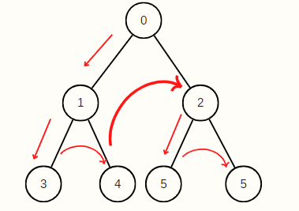
</p>


### Características de la Búsqueda en Profundidad

* Cualquier implementación del algoritmo de Búsqueda en profundidad categoriza los nodos en dos estados: visitado y no visitado. 

* Este algoritmo de búsqueda tiene el propósito de recorres todos los nodos de la estructura de datos evitando los ciclos, por lo tanto, se marcan los nodos ya visitados.  

* Se emplea el backtracking debido a que cuando se están explorando los nodos adyacentes y ya no se encuentran más, este retrocede a nodos ya visitados para hallar nuevos nodos (vecinos) que no se hayan visitado.  

* Para su implementación de utiliza la estructura de datos conocido como pila. 

* Útil para la representación de problemas cuya solución se encuentre en lo más profundo del árbol/grafo. 

### Proceso para implementar la Búsqueda en Profundidad

<p align="center">
  
</p>

1. Declarar una pila de tamaño igual al número total de nodos del árbol o grafo. 

2. Seleccionar un nodo como punto de inicio e insertarlo a la pila. 

3. Insertar uno de los nodos no visitados (nodo adyacente al que se encuentra hasta arriba de la pila) a la pila. 

4. Repetir el paso 3 hasta que se hayan visitado todos los nodos adyacentes al nodo que este hasta arriba de la pila.  

5. Cuando no haya más nodos adyacentes, quitar el nodo de hasta arriba de la pila. 

6. Repetir el paso 3, 4 y 5 hasta que la pila no contenga ningún elemento. 

### Estrategias para implementar la Búsqueda en Profundidad

Al recorrer todos los nodos de un grafo o árbol existen diferentes formas de hacerlo, las cuales se pueden categorizar según el orden en que se visitan los nodos o la dirección. Es por eso, que la Búsqueda en Profundidad es aplicable por medio de tres estrategias: in-orden (en medio), post-orden (después) y pre-orden (antes). 

### In-orden (en medio) 

<p align="center">
  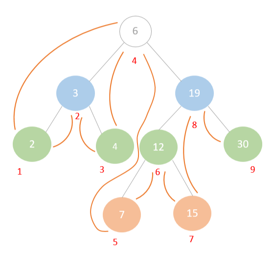
</p>

1. Se empieza por la raíz y se observa si se tiene un hijo izquierdo. En caso de que lo tenga este se continúa revisando hasta ya no encontrar nodos hijo del lado izquierdo y se marca como visitado el último.  

2. Después, cuando no haya más subárboles izquierdos se recorre el nodo raíz del último nodo recorrido. 

3. Luego, se recorre el hijo derecho y se retrocede para recorrer el subárbol derecho. 

### Post-orden (después) 

1. Se comienza por la raíz y se busca el hijo izquierdo que se encuentre a mayor profundidad para recorrerlo. (subárbol izquierdo) 

2. Luego, se recorre a sus vecinos derechos. 

3. Por último, se recorre el nodo raíz de estos. 

<p align="center">
  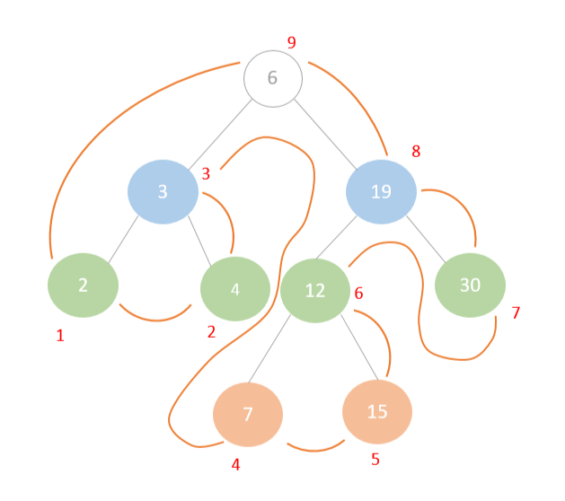
</p>

### Pre-orden (antes) 

1. En este primero se recorre el nodo raíz. 

2. Posteriormente, se recorre el hijo izquierdo y se continúa buscando hijos izquierdos a partir de este.  

3. Cuando se termina de recorrer el subárbol izquierdo, se visitan todos los hijos derechos. 

<p align="center">
  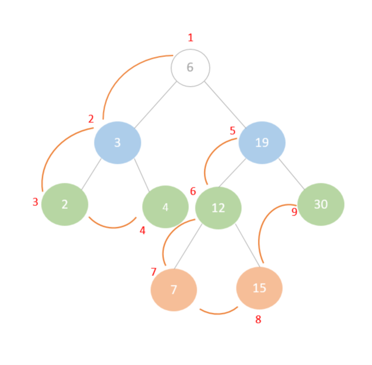
</p>

### Aplicaciones de la Búsqueda en Profundidad 

* Solucionar laberintos o puzzles que cuenten con una única solución  

* Se puede emplear para detectar si existen ciclos en un grafo 

* Analizar redes para comprobar si un grafo es bipartito 

* Para encontrar el camino a un nodo específico 

* Es complemento del ordenamiento topologico de un grafo 


### Ejemplo de Búsqueda en Profundidad

Para el ejemplo de búsqueda en profundidad se empleó un grafo compuesto de 5 nodos. Por lo que, primero se declara una pila de tamaño equivalente al número total de nodos de la estructura de datos. Después, se selecciona un nodo como punto de inicio, en este caso se eligió el nodo número 1. Luego, se marca como visitado el nodo 1 y este se coloca en la pila. 

<p align="center">
  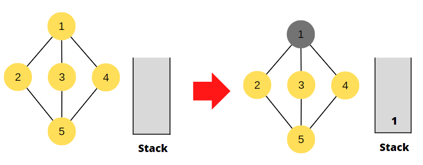
</p>

Posteriormente, se analizan los nodos adyacentes (no visitados) a este. De modo que, el nodo dos se explora y es marcado. A continuación, este es agregado a la parte superior de la pila. Seguidamente, se observan los nodos adyacentes al nodo 2, siendo el nodo 5 el único aun no visitado. Por lo cual, este es marcado como recorrido e insertado a la pila. 

<p align="center">
  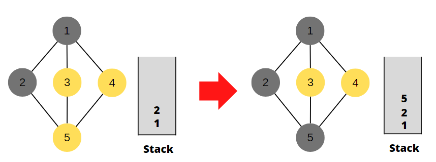
</p>
 
Más adelante, se vuelven a revisar los nodos adyacentes, pero del nodo 5. Así, que se visita el nodo 3 y este se añade a la pila. Ulteriormente, se verifican los nodos adyacentes al nodo 3, pero al haber solo nodos ya visitados se extrae el elemento que se encuentra hasta arriba de la pila. Para nuevamente consultar por nodos adyacentes al nodo 5 que aún no hubieran sido visitados.  

<p align="center">
  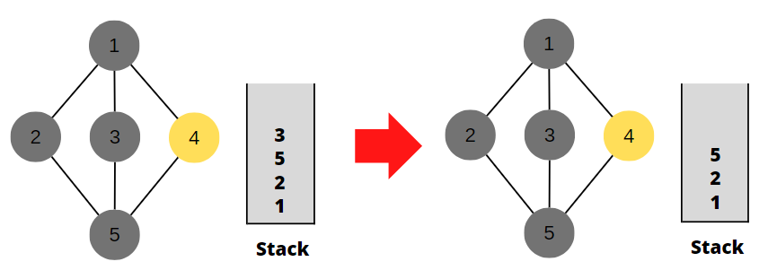
</p>

Por lo tanto, se marca el nodo 4 como visitado y es insertado en la pila. Por último, al no existir más nodos que recorrer se extrae el elemento superior de la pila que es 4.  

<p align="center">
  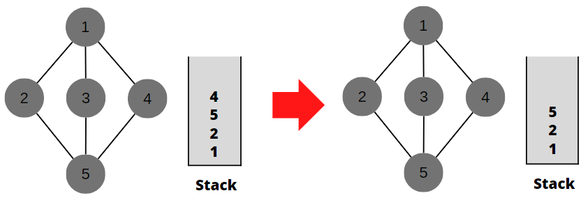
</p>

De manera que, se continúan extrayendo elementos de la pila hasta que esta esté vacía. 

<p align="center">
  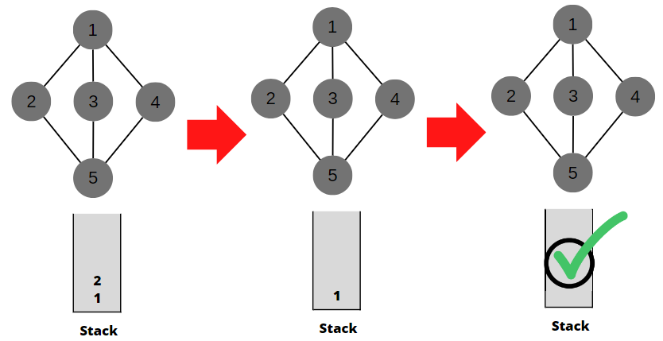
</p>

## Búsqueda en Amplitud o Anchura
<p align="center">
  
</p>

Es un algoritmo con el que recorremos y/o buscamos elementos de un grafo. La búsqueda de ancho se utiliza para aquellos algoritmos donde es crítico elegir el mejor camino posible en cada momento del recorrido. Este algoritmo de grafos es muy útil en diversos problemas de programación. Por ejemplo, halla la ruta más corta cuando el peso entre todos los nodos es 1, cuando se requiere llegar con un movimiento de caballo de un punto a otro con el menor número de pasos, cuando se desea transformar algo un numero o cadena en otro realizando ciertas operaciones como suma producto, pero teniendo en cuenta que no sea muy grande el proceso de conversión, o para salir de un laberinto con el menor número de pasos, etc. Podrán aprender a identificarlos con la práctica. 

### Características 
* Algoritmo Optimizador: Esta característica es una de las más importantes ya que hablamos de que el algoritmo aun cuando encuentra la solución, busca la forma de encontrar el camino más corto o la solución más optima. 

* FIFO: Para que el algoritmo pueda recorrer de la mejor forma la gráfica o el grafo, sigue este procedimiento, por lo cual forma una cola en la cual añade la ruta que uso y por lo tanto es más fácil que optimice.  

* Nodos Vecinos: A diferencia de DFS en este caso el algoritmo busca los vecinos del nodo que está analizando y avanza hacia estos, en este caso busca a los nodos de menor profundidad. 

* Nodos Procesado/No procesados: La manera de clasificar de este algoritmo es muy similar a la de DFS de igual rectifica que el nodo se haya visitado o no, sin embargo, este algoritmo se haya expandido es por eso que los toma como procesado o no. 

### Proceso para implementar la Búsqueda en Anchura
<p align="center">
  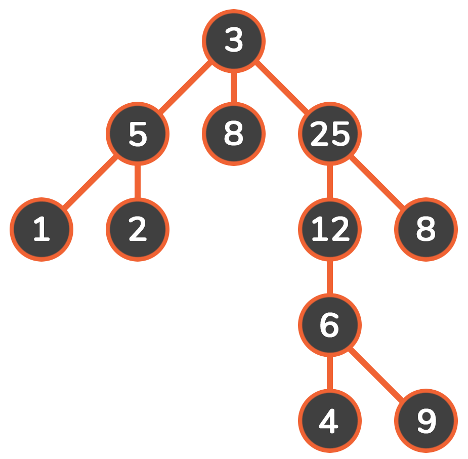
</p>


Declarar una cola de tamaño igual al número de nodos que tenemos. 

Seleccionar nuestro nodo raíz para que, a partir de este, comenzamos a recorrer nuestro grafo. 

A partir de que visitamos nuestro nodo raíz, pasamos a los nodos vecinos. Es decir, los que se encuentra a profundidad I y no I+1. 

Después de visitar al segundo nodo, pasamos al vecino de este, sin olvidar que al nodo que ya visitamos debemos expandirlo en caso de ser necesario. 

Este paso lo repetimos hasta visitar todos los nodos (en caso de ser necesario ya que como mencionamos este algoritmo busca optimizar y por lo tanto si encuentra antes el nodo objetivo, ya no es necesario que busque en los demás nodos. 

En caso de que se recorran todos los nodos y no encontremos solución, comenzaremos a extraer datos de nuestra cola empezando por el más antiguo ya que seguimos el procedimiento de FIFO 

Repetimos los pasos 3, 4 y 5 mientras la cola tenga elementos. 

### Aplicaciones del Algoritmo BFS
<p align="left">
  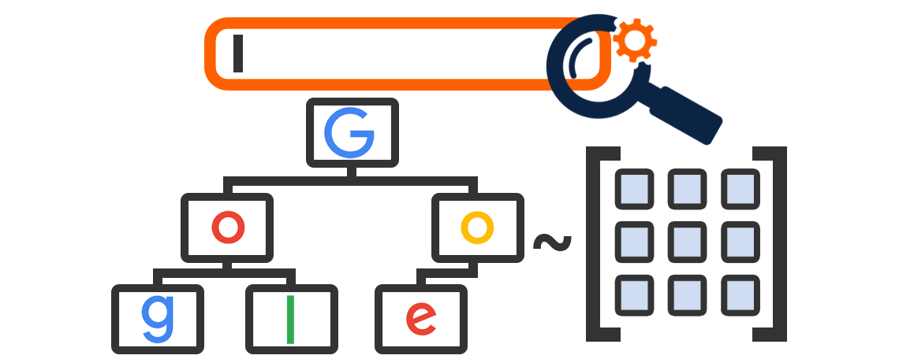
</p>

<p align="right">
  
</p>
Redes sociales: En las redes sociales, podemos encontrar personas dentro de una distancia dada 'k' de una persona utilizando Breadth First Search hasta niveles 'k'.   

Sistemas de navegación GPS: Breadth First Search se utiliza para encontrar todas las ubicaciones vecinas.   

Rastreadores en motores de búsqueda: Los rastreadores construyen un índice usando Breadth First. La idea es comenzar desde la página fuente y seguir todos los enlaces desde la fuente y seguir haciendo lo mismo. Depth First Traversal también se puede usar para rastreadores, pero la ventaja de Breadth First Traversal es que la profundidad o los niveles del árbol construido pueden ser limitados. 

Radiodifusión en red: En las redes o en motores de búsqueda, un paquete difundido sigue la búsqueda primero en amplitud para llegar a todos los nodos.   

Búsqueda de caminos: Podemos usar primero la amplitud o primero el recorrido transversal para encontrar si hay un camino entre dos vértices.   

Procesamiento de imágenes: BFS se puede usar para llenar una imagen con un color particular o para encontrar componentes conectados de píxeles. 

### Ejemplo Búsqueda en Amplitud o Anchura
<p align="center">
  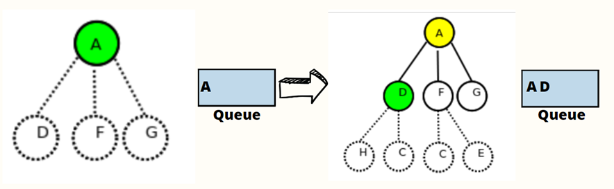
</p>
Para nuestro ejemplo ocupamos un grafo con 14 nodos, sin embargo, no fue necesario recorrer todos esto es lo más importante, em primer entra primera imagen podemos observar la creación de nuestra cola del tamaño de nuestros nodos. Comenzamos visitando nuestro nodo raíz que en este seleccionamos al de menor profundidad en este caso es A, lo visitamos y como no es el nodo que estamos buscando lo agregamos a nuestra cola, de igual forma podemos observar que expandimos los nodos vecinos de la raíz como observamos son D, F, G. 
A continuación, observamos que pasamos al nodo D, como observamos se agrega a la lista ya que de igual forma no es la solución que estamos buscando. Por otra parte, aunque podemos observar los nodos hijos de D y F, los únicos que hemos expandido son los nodos de D ya que como explique este nodo ya fue visitado. 

<p align="center">
  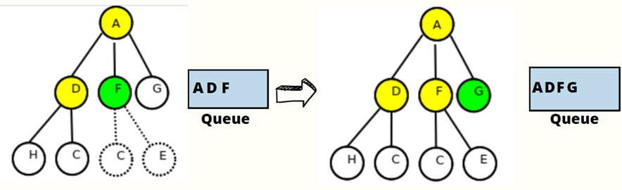
</p>

En esta segunda imagen observamos que avanzamos al nodo F, dado que nuevamente no es la solución óptima la agregamos a la cola, es importante recalcar que se ordenan de esa forma ya que siguen el principio FIFO, como podemos observar en el siguiente paso los nodos de F ya se expandieron esto como consecuencia de que ya recorrimos este nodo, pasamos a G y de la misma manera se añade a la cola al no ser la solución que buscamos , sin embargo una diferencia importante que observamos es que este nodo no tiene hijos es por esto que no observamos conexiones debajo de él. 

<p align="center">
  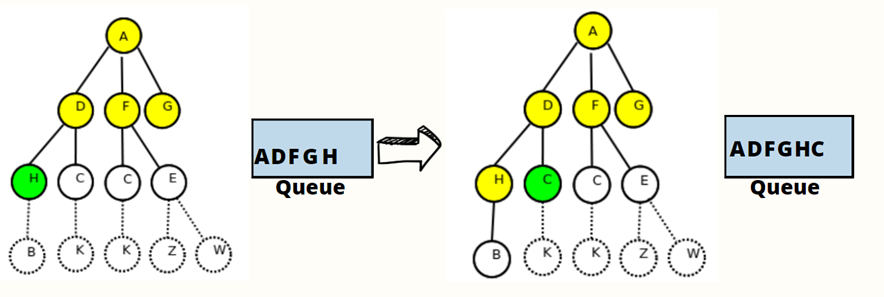
</p>

En esta tercera imagen observamos que avanzamos al siguiente nivel y comenzamos con los hijos del nodo más antiguo después del que es raíz, por lo tanto, son los hijos de D que en este caso son H y C, comenzamos con H y vemos que se añade a la cola esto como consecuencia de que no es aún solución, en la siguiente imagen observamos que ya se expandió H y tiene un solo hijo sin embargo esto ya no es relevante, ya que a continuación tenemos el Nodo c, que es el nodo que estamos buscando  por lo tanto ya no se expandió este nodo ni los que siguen. 

<p align="center">
  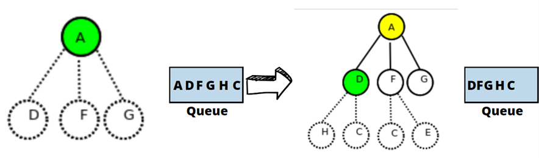
</p>

Este algoritmo reinicia el recorrido para verificar que el camino que encontró sea el óptimo, es por eso que de nueva cuenta comenzamos en A, ya que este nodo era el más antiguo que se encontraba en nuestra cola y aplicando el procedimiento FIFO, el más antiguo es el primero en salir, por esta misma razón es que el nodo que continua es B y como observamos estos dejan de estar en la cola. 

<p align="center">
  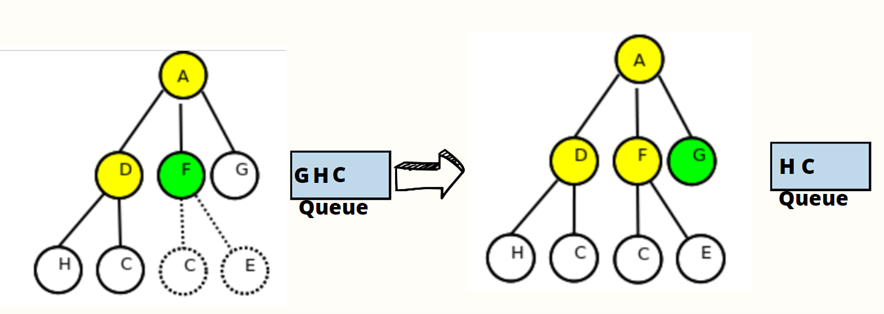
</p>

De igual forma en esta imagen continuamos con el mismo proceso que el anterior, al ser F el que sigue en la cola sale y continuamos con G de esta forma el algoritmo verifica que la secuencia que obtuvo en el primer recorrido sea la correcta.  

<p align="center">
  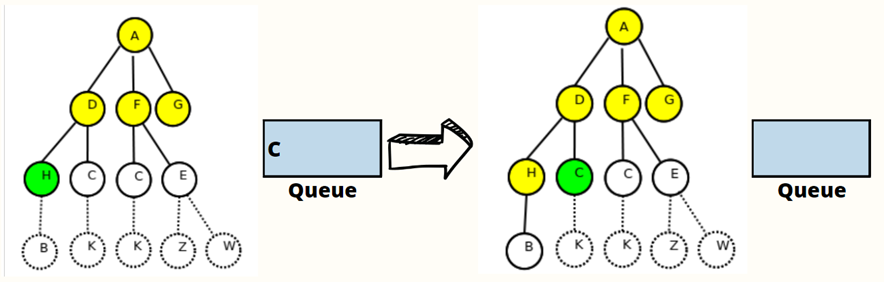
</p>
Por último, en esta imagen observamos que nuestro algoritmo termina de verificar que efectivamente tomo el camino optimo y correcto. Ya que la lista queda vacía y obtuvo el mismo recorrido y llego al nodo que estaba buscando. Otro punto importante a destacar es la confirmación de que efecto a pesar de que los nodos puedan tener hijos no es necesario recorrerlos a todos para encontrar el mejor camino.  


## Ejemplo de DFS en Prolog

<p align="center">
  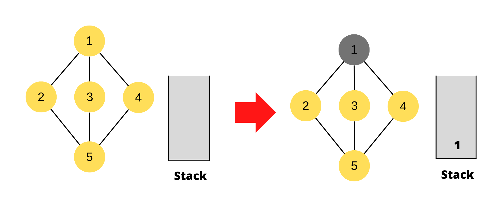
</p>

```pl
s(1,2).
s(1,3).
s(1,4).
s(2,5).
s(3,5).
s(4,5).
goal(5).
```

Se creo el ejemplo visto anteriormente en prolog, se necesita el nodo inicial, el goal node y el path que es una collecion que representara un grafo.

```pl
member(X,[X|_]).
member(X,[_| Tail]) :- member(X, Tail).
```

En member solo ayudara a saber los valores del grafo.

```pl
solve(Node, Solution):-
  depthfirst( [],Node, Solution).
  
depthfirst(Path, Node, [Node|Path]):-
  goal(Node).
```  

En esta parte del codigo parará si el goal node ya fue encontrar 

```pl
depthfirst(Path, Node, Sol):- 

  s(Node, Node1), 

  not(member(Node1,Path)), 

  depthfirst([Node|Path], Node1, Sol). 
```

En esta parte el codigo es iterado, es decir, se va a repetir, en este caso va a seleccionar un node y el node siguiente (node1), si no fue visitado y no es el goal node esta pasa ser el node principal y el siguiente node será node1, así sucesivamente.

<p align="center">
  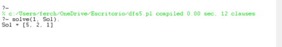
</p>

Este es la solución, se debe insertar solve(1, Sol). Y dará el resultado de la búsqueda de profundidad.


```pl
s(a,b). 
s(a,c). 
s(b,d). 
s(b,e). 
s(c,f). 
s(c,g). 
s(d,h). 
s(e,i). 
s(e,j). 

goal(f).  
goal(j). 
```

<p align="center">
  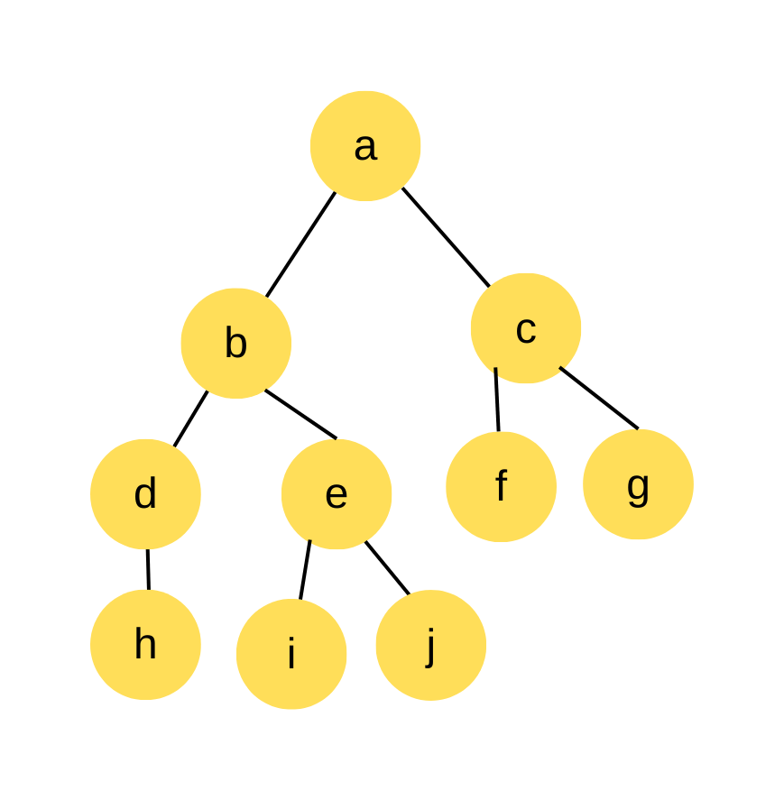
</p>

Se creó otro ejemplo en prolog con dos goal nodes f y j, siguiente el mismo paso anterior, encontrará el camino del goal f y goal j como se muestra en la imagen de abajo. Le damos en solve el node de inicio y Sol. 

<p align="center">
  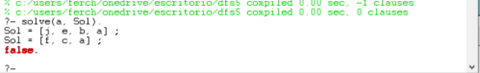
</p>

### Búsqueda en profundidad (DFS) 
* Poner en cola nodos en nodos en orden LIFO (último en entrar, primero en salir). Es decir, nodos utilizados como estructura de datos de pila para ordenar nodos. 
* No puede terminar sin un "límite de profundidad", es decir, cortar la búsqueda por debajo de una profundidad fija D ("búsqueda de profundidad limitada") 
* Tiempo exponencial, O(bd), pero solo espacio lineal, O(bd) 
 
### Complejidad 
Se ve que cada vértice se lo mira a lo sumo una vez, y en una visita al nodo se lo agrega/saca de la pila, y se hacen operaciones de tiempo constante, por lo que tenemos O(V) tiempo para los vértices. Además, cada arista se ve también a lo sumo una vez, tomando O(E) tiempo. En total, la complejidad temporal es O(V+E), que en términos de grafos es óptimo.  
La complejidad espacial es sencilla de ver. Tenemos el grafo que guarda una entrada por arista (en realidad dos, para la arista (u,v) guarda v en el vector de u y u en el vector de v). Luego, el arreglo de visitados tiene una variable por nodo, y en la pila (en el primer caso) a lo sumo están todos a la vez, una sola vez (si el nodo inicial es vecino de todos). Entonces la complejidad espacial también se ve que es O(V+E). 

### Ventajas
- Puede encontrar soluciones largas rápidamente si tiene suerte (¡y soluciones cortas lentamente si tiene mala suerte!) 
- DFS consume poco espacio de memoria, , ya que solo se almacenan los nodos en la ruta actual. Esto contrasta con la búsqueda primero en amplitud, donde se deben almacenar todos los árboles que se han generado hasta ahora. 
- Llegará al nodo de destino en un período de tiempo menor que BFS si atraviesa el camino correcto. 
- Puede encontrar una solución sin examinar gran parte de la búsqueda porque podemos obtener la solución deseada en el primer intento. 
- Encuentra el elemento distante más grande (desde el vértice de origen) en menos tiempo. 
- La búsqueda primero en profundidad puede encontrar una solución sin examinar gran parte del espacio de búsqueda. Esto contrasta con la búsqueda primero en amplitud en la que todas las partes del árbol deben examinarse hasta el nivel n antes de que se puedan examinar los nodos en el nivel n + i. Esto es particularmente significativo si existen muchas soluciones aceptables. La búsqueda en profundidad puede detenerse cuando se encuentra uno de ellos. 
### Desventajas: 
* No completo (con o sin detección de ciclo, y con o sin profundidad de corte) 
- Cuando la búsqueda llega a un callejón sin salida, solo puede retroceder un nivel a la vez, incluso si el "problema" ocurre debido a una mala elección del operador cerca de la parte superior del árbol. Por lo tanto, solo el "retroceso cronológico". 
- Puede no encontrar la solución óptima al problema. 
- Puede quedar atrapado en la búsqueda de un camino. 
- En la búsqueda en profundidad “cada nodo tiene dos tiempos asociados: el tiempo de descubrimiento y el tiempo de finalización” (Kravitz, David & Lafferty, 1997). Si el parámetro de búsqueda es grande (es decir, una gran cantidad de nodos), entonces "el almacenamiento requerido para todos estos tiempos se vuelve" rápidamente inmanejable. 
- A veces, los estados también pueden entrar en bucles infinitos. 
- Puede encontrar una solución subóptima (una que sea más profunda o más costosa que la mejor solución) 
 
### Búsqueda por amplitud (BFS) 
* Encolar nodos en nodos en orden FIFO (primero en entrar, primero en salir). 
* Completo 
* Óptimo (es decir, admisible) si todos los operadores tienen el mismo costo. De lo contrario, no es óptimo, pero encuentra la solución con la longitud de ruta más corta. 
* Complejidad exponencial de tiempo y espacio, O(bd), donde d es la profundidad de la solución y b es el factor de ramificación (es decir, el número de hijos) en cada nodo 
* Tomará mucho tiempo encontrar soluciones con una gran cantidad de pasos porque primero se deben considerar todas las posibilidades de longitudes más cortas 
– Un árbol de búsqueda completo de profundidad d donde cada nodo no hoja tiene b hijos, tiene un total de 1 + b + b2 + ... + bd = (b(d+1) - 1)/(b-1) nodos 
– Para un árbol de búsqueda completo de profundidad 12, donde cada nodo de profundidad 0, ..., 11 tiene 10 hijos y cada nodo de profundidad 12 tiene 0 hijos, hay 1 + 10 + 100 + 1000 + ... + 1012 = (1013 - 1)/9 = O(1012) nodos en el árbol de búsqueda completo. Si BFS se expande 1000 nodos/seg y cada nodo usa 100 bytes de almacenamiento, BFS tardará 35 años en ejecutarse en el peor de los casos, ¡y usará 111 terabytes de memoria! 
### Complejidad de BFS
Suponiendo que explorar los vecinos de un nodo tiene un costo proporcional a su grado (por ejemplo, como ocurre al usar listas de adyacencia), todas estas versiones del algoritmo tienen una complejidad O(n+m). Esto es porque cada nodo es procesado cuando es rosa, y un nodo es rosa durante únicamente un paso. Por lo tanto, se trabaja con un nodo explorando sus vecinos una única vez en todo el algoritmo. Si explorar los vecinos de un nodo cuesta proporcional a su grado, el costo total del algoritmo, además de un O(n) fijo para crear el arreglo de visitados y similares estructuras, tendrá un costo igual a la suma de todos los grados, que es 2m. Por lo tanto el total es O(n+m), proporcional al total de nodos y ejes del grafo, lo cual es muy bueno.  
Si se utilizara matriz de adyacencia, el costo de buscar los vecinos de un nodo sería siempre O(n), sin importar su grado. En este caso, el costo de explorar cada uno de los n nodos sería siempre n, y en total el costo sería O(n^2). Muchas veces es perfectamente razonable un costo de O(n^2), y en estos casos se puede utilizar perfectamente BFS con matriz de adyacencia. 

### Ventajas de BFS
* Encuentra la solución mínima en caso de múltiples caminos, encontrando el camino más corto entre vértices, ya que busca nivel por nivel. 
* Una de las estrategias de búsqueda más simples. 
- Completo. Si hay una solución, BFS está garantizado para encontrarla. 
- Si hay múltiples soluciones, entonces se encontrará una solución mínima. 
- El algoritmo es óptimo (es decir, admisible) si todos los operadores tienen el mismo costo. De lo contrario, la búsqueda primero en amplitud encuentra una solución con la ruta de acceso más corta. 
- Encuentra la meta más cercana en menos tiempo 
- BFS no sufre ningún problema potencial de bucle infinito 
- BFS funcionará bien si el espacio de búsqueda es pequeño. Funciona mejor si el estado objetivo se encuentra en la parte superior izquierda del árbol. 
 
### Desventajas de BFS
* BFS consume gran espacio de memoria. Su complejidad temporal es mayor. 
* Requiere la generación y el almacenamiento de un árbol cuyo tamaño es exponencial a la profundidad del nodo objetivo menos profundo. 
* El algoritmo de búsqueda primero en amplitud no se puede usar de manera efectiva a menos que el espacio de búsqueda sea bastante pequeño. 
* Todos los vértices conectados deben almacenarse en la memoria. Entonces consume más memoria 
* BFS es una búsqueda "ciega", cuando el espacio de búsqueda es grande, el rendimiento de la búsqueda será deficiente en comparación con otras búsquedas heurísticas. 
* BFS funcionará relativamente mal en relación con el algoritmo de búsqueda primero en profundidad si el estado objetivo se encuentra en la parte inferior del árbol. BFS siempre encontrará la ruta más corta si el peso en los enlaces es uniforme.  
* BFS necesita más memoria en comparación con DFS. 
 
## Ejemplo de BFS en Prolog

Este codigo se mantiene en cualquier implementacion a realizar, ya que a partir de este se hace la busqueda en base a los arboles declarados 

```pl
% Implementation BFS
bfs(Start, Objetive, Path) :-
    bfs_search([[Start]], Objetive, Path).

bfs_search([[Objetive | Visited] | _], Objetive, [Objetive | Visited]) :-
    writef("Objetive found: %w\n", [Objetive | Visited]).
bfs_search([[Actual | Visited] | Queue], Objetive, Path) :-
    writef("Actual node: %w\n", [[Actual | Visited]]),
    findall([Child, Actual | Visited], (father(Actual, Child), \+ member(Child, Visited)), Childs),
    append(Queue, Childs, NuevaQueue),
    bfs_search(NuevaQueue, Objetive, Path).
```

La cláusula bfs(Start, Objetive, Path) es una interfaz o punto de entrada para el usuario que desea realizar una búsqueda en anchura. El cuerpo de la cláusula simplemente invoca a la cláusula bfs_search([[Start]], Objetive, Path). con una lista que contiene una lista con el nodo de inicio como único elemento, y los argumentos Objetive y Path.

En otras palabras,  bfs(Start, Objetive, Path) es una cláusula de envoltorio que se utiliza para invocar bfs_search([[Start]], Objetive, Path) con los argumentos correctos, proporcionando una forma más fácil y clara para el usuario de llamar a la búsqueda en anchura.

La cláusula bfs_search([[Objetive | Visited] | _], Objetive, [Objetive | Visited]) es la cláusula principal que implementa la búsqueda en anchura. El primer argumento es la cola de búsqueda, que es una lista de listas que representa los nodos que aún deben ser visitados.

El cuerpo de la cláusula compara el primer elemento de la primera lista en la cola con el objetivo, y si son iguales, significa que se ha encontrado el objetivo. En este caso, el camino al objetivo se construye a partir de la primera lista, y se escribe un mensaje indicando que se ha encontrado el objetivo.

La cláusula es una condición de terminación para la búsqueda en anchura. Si se encuentra el objetivo, la cláusula devuelve el camino como tercer argumento, y la búsqueda termina. De lo contrario, la búsqueda continúa hasta que se agote la cola o se encuentre el objetivo.

La cláusula bfs_search/3 es la cláusula principal que implementa la búsqueda en anchura. El primer argumento es la cola de búsqueda, que es una lista de listas que representa los nodos que aún deben ser visitados.

El cuerpo de la cláusula primero escribe un mensaje que indica el nodo actual que se está visitando. Luego, usa la función findall/3 para encontrar todos los hijos del nodo actual que no han sido visitados antes, y los agrega a la cola. Finalmente, llama recursivamente a bfs_search/3 con la nueva cola.

Esta cláusula es el núcleo de la búsqueda en anchura, ya que proporciona la lógica para explorar los hijos de cada nodo y continuar la búsqueda hasta que se encuentre el objetivo o se agote la cola.

Este es el primer arbol:
<p align="center">
  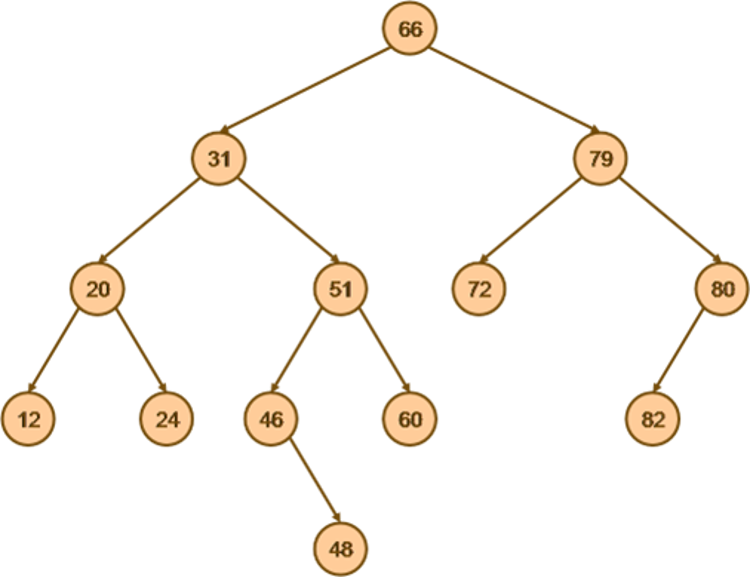
</p>
Su declaración en Prolog

```pl
% Define relation father-Child
father(66, 31).
father(66, 79).
father(31, 20).
father(31, 51).
father(79, 72).
father(79, 80).
father(20, 12).
father(20, 24).
father(51, 46).
father(51, 60).
father(80, 82).
father(46, 48).
```
El resultado de la busqueda mas larga:

<p align="center">
  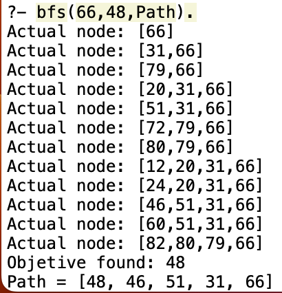
</p>
Este es el segundo arbol:

<p align="center">
  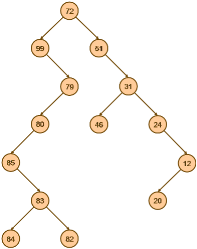
</p>
Su declaración en Prolog:

```pl
% Define relation father-Child
father(72, 99).
father(72, 51).
father(99, 79).
father(51, 31).
father(79, 80).
father(31, 46).
father(31, 24).
father(80, 85).
father(24, 12).
father(85, 83).
father(12, 20).
father(83, 84).
father(83, 82).
```

El resultado de la busqueda mas larga:
<p align="center">
  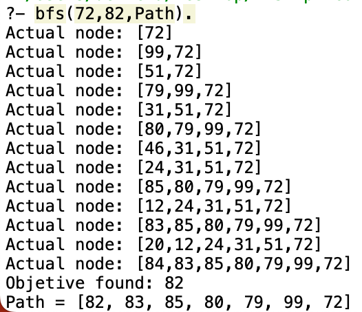
</p>

### Referencias
ALGORITMO DE BÚSQUEDA: BREADTH FIRST SEARCH. (2016, 3 November). Algorithms and More. https://jariasf.wordpress.com/2012/02/27/algoritmo-de-busqueda-breadth-first-search/ 

Búsqueda en amplitud (BFS): implementación iterativa y recursiva. (s. f.). https://www.techiedelight.com/es/breadth-first-search/

Cambal, H. (s. f.). Tipos de búsqueda en inteligencia artificial. https://es.slideshare.net/hendavidcambarahona/tipos-de-bsqueda-24524005

Difference between Breadth Search (BFS) and Deep Search (DFS). (2020, 25 May). Encora. https://www.encora.com/es/blog/dfs-vs-bfs

Dr. Himani Mittal. (2021, June 25). depth first search in prolog [Video].
YouTube. https://www.youtube.com/watch?v=t1vJYqoK3ec 

Depth First Search Algorithm Prolog. (2014, November 21). Stack Overflow. https://stackoverflow.com/questions/27065774/depth-first-search-algorithm-prolog 

GeeksforGeeks. (2023, 27 January). Applications of Breadth First Traversal. https://www.geeksforgeeks.org/applications-of-breadth-first-traversal/

algoritmos-oia:grafos:dfs [OIA-Wiki]. (s. f.). http://wiki.oia.unsam.edu.ar/algoritmos-oia/grafos/dfs 

GeeksforGeeks. (2023, 6 February). Graph Data Structure And Algorithms. https://www.geeksforgeeks.org/graph-data-structure-and-algorithms/ 

algoritmos-oia:grafos:bfs [OIA-Wiki]. (s. f.). http://wiki.oia.unsam.edu.ar/algoritmos-oia/grafos/bfs?s[]=bfs 

Ravikiran, A. (2022, October 27). Your One-Stop Solution to Learn Depth-First Search(DFS) Algorithm From Scratch. simplilearn. https://www.simplilearn.com/tutorials/data-structure-tutorial/dfs-algorithm

baeldung. (2022, November 25). Methods of Depth First Traversal and Their Applications. https://www.baeldung.com/cs/depth-first-traversal-methods#:~:text=In%20this%20tutorial%2C%20we'll,to%20any%20type%20of%20graph. 

tutorialspoint. (2023). Data Structure - Depth First Traversal. https://www.tutorialspoint.com/data_structures_algorithms/depth_first_traversal.htm

programiz. (n.d.). Depth First Search (DFS). https://www.programiz.com/dsa/graph-dfs

Difference between breadth search (BFS) and Deep Search (DFS). (n.d.). Retrieved February 6, 2023, from https://www.encora.com/es/blog/dfs-vs-bfs

Swi-Prolog for sharing. (n.d.). Retrieved February 6, 2023, from https://swish.swi-prolog.org/p/Tutorial%20de%20prolog.swinb


